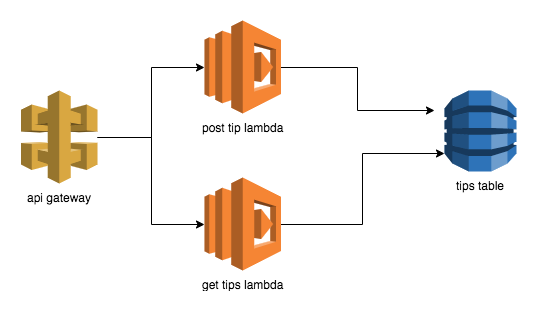

# CodingTips



## Prerequisites
* install and configure AWS cli
* install Terraform

## Build And Deploy
Update the profile in `general.tf`.  
`./build-and-deploy.sh`

### Deploy using terraform

```
cd terraform
terraform init
terraform apply
```

